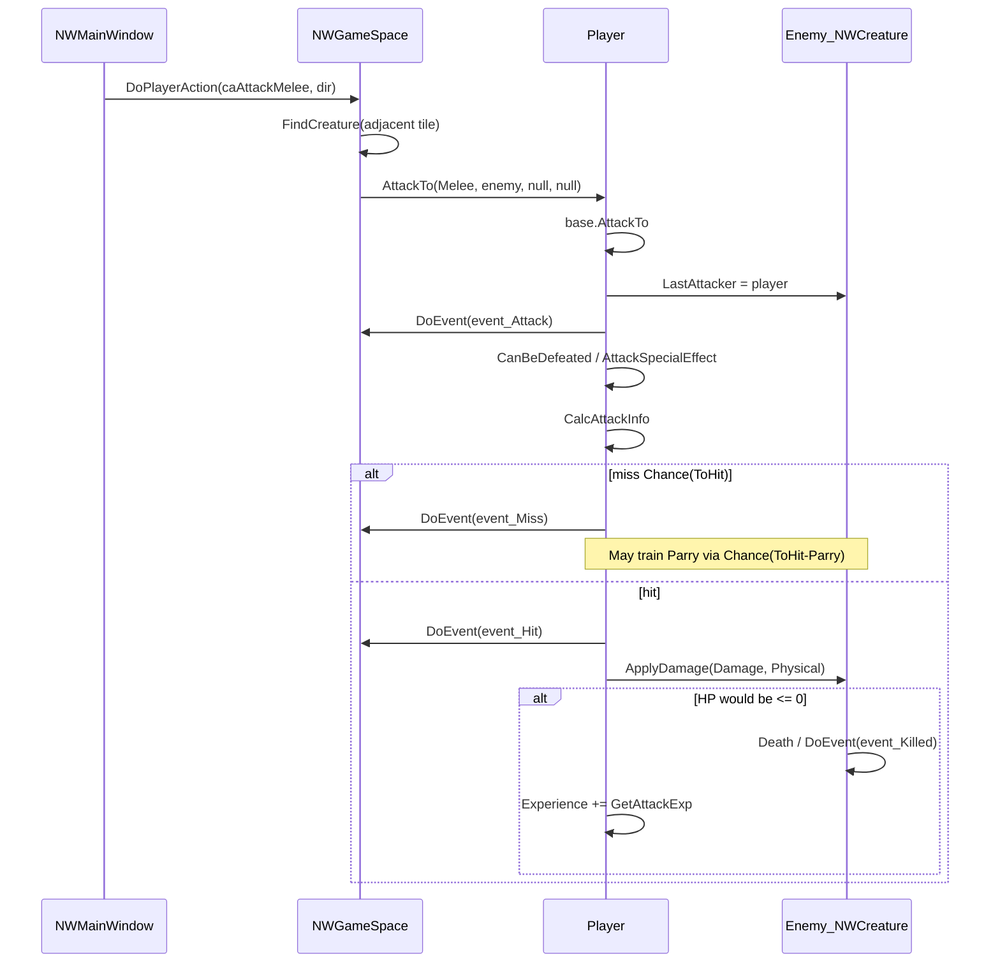

# 07 — Combat call graph

Tracks GitHub issue [#7](https://github.com/lucas-albers-lz4/NorseWorld-Ragnarok/issues/7).  
Primary code: [`project/Creatures/NWCreature.cs`](../../project/Creatures/NWCreature.cs).

## Player melee cycle

## Entry points

| Source | Path |
|--------|------|
| Player melee | [`NWGameSpace.DoPlayerAction`](../../project/Game/NWGameSpace.cs) `caAttackMelee` (~803) → `Player.AttackTo` → `NWCreature.AttackTo` |
| Player shoot | `caAttackShoot` → `Player.ShootToDir` → `Projectile` → `AttackTo(Shoot/Throw, …)` ([`Projectile.cs`](../../project/Creatures/Projectile.cs) ~134) |
| AI melee | [`BeastBrain`](../../project/Creatures/Brain/BeastBrain.cs) ~453 → `AttackTo(Melee, …)` |
| Other | `NWCreature` ~3450 self `AttackTo(Melee, …)` |

## Core methods (line refs)

| Step | Method | Lines (approx) |
|------|--------|----------------|
| Orchestrate | `AttackTo` | 1839–1905 |
| Hit/damage roll | `CalcAttackInfo` | 1750–1837 |
| Apply HP / death | `ApplyDamage` | 1688–1721 |
| Death | `Death` → `PostDeath` → `NWGameSpace.PostDeath` | 2628–2680, GS ~2081 |
| XP | `GetAttackExp` | 4275–4288 |
| Weapon pick | `GetWeaponDamage` / equip `Item.InUse` | 3150+, Item.cs ~94–131 |

## Notes

- Melee uses `PrimaryWeapon` when `weapon == null`.
- Enemy **armor skill** (from worn torso armor kind) reduces physical damage by `skill/10` in `CalcAttackInfo` (#60). Java v0.11 never applied this (same FIXME left unimplemented); remake mirrors Parry's `/10` divisor. Skill still trains +1 on non-lethal hits.
- `AttackSpecialEffect` is largely stubs (`AuxUtils.ExStub`) for named bosses; Enchantress charm text is live.
