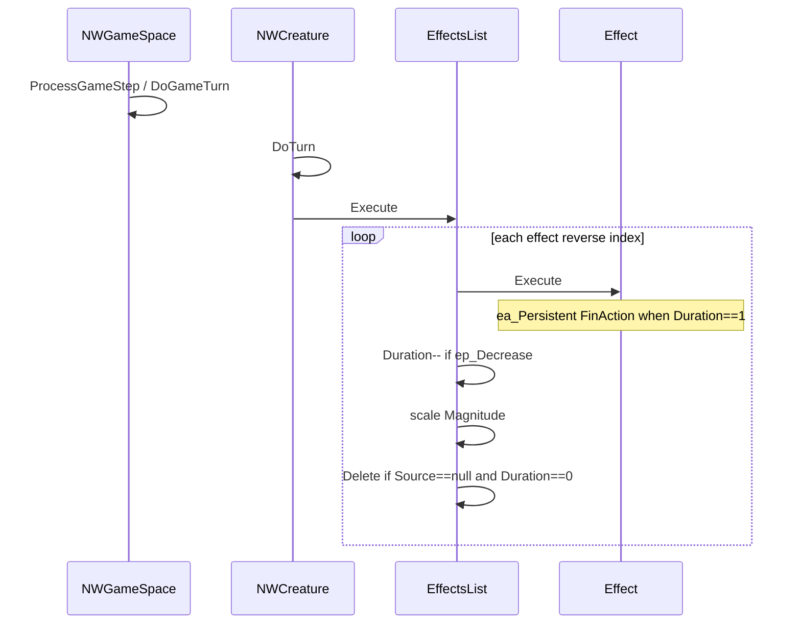

# 10 — Effect lifecycle

Issue [#8](https://github.com/lucas-albers-lz4/NorseWorld-Ragnarok/issues/8).

## Creation / application

| Path | Code |
|------|------|
| Spells / items / traps | `NWCreature.UseEffect` → `Effect.InvokeEffect` ([NWCreature.cs](../../project/Creatures/NWCreature.cs) ~4166) |
| Persist on creature | `AddEffect` → `EffectsList.Add` |
| Equip-sourced | `Item.InUse` / `ApplyEffects` with `Source = item` |
| Map / ray FX | `EffectsFactory` + `EffectRay.Exec` / `FyleischCloud` |

## Turn tick

Also: `NWField` / `NWLayer` call their own `fEffects.Execute()` for map effects.

## Effect.Execute actions

[`Effect.cs`](../../project/Effects/Effect.cs) ~92–150:

| Action | When `exec` |
|--------|-------------|
| `ea_Instant` | never in tick (applied at invoke) |
| `ea_Persistent` | `Duration == 1` → `im_FinAction` |
| `ea_EachTurn` | every tick |
| `ea_RandomTurn` | 10% chance |
| `ea_LastTurn` | `Duration == 1` |

Requires `CurrentField != null` for creature owners (early return otherwise).

## Stacking

`EffectsList.Add`: if same CLSID exists and `Assign` returns true (`ef_Cumulative` + both `Source == null`), merge Duration/Magnitude and dispose duplicate; else append.

## Persistence

- `SerializeKind` = `SID_EFFECT` only when `Source == null`; item-sourced buffs skipped (expect re-apply on equip).
- Stream: Action, Duration, Magnitude after CLSID.
- Harness `effect-persist` (prowling fixture) passed at audit baseline.

## Critical interaction: Prowling

`eid_Prowling` is `ea_Persistent` + `ep_Decrease`. On last tick, `Execute` → `im_FinAction` → `ProwlingEnd` → **`LoadFromStream` into the same creature**, which **clears/reloads `fEffects` while `EffectsList.Execute` is still iterating** → Index out of range (seen in `Ragnarok.log`). Comment in `EffectsList` acknowledges Prowling mutates the list.
